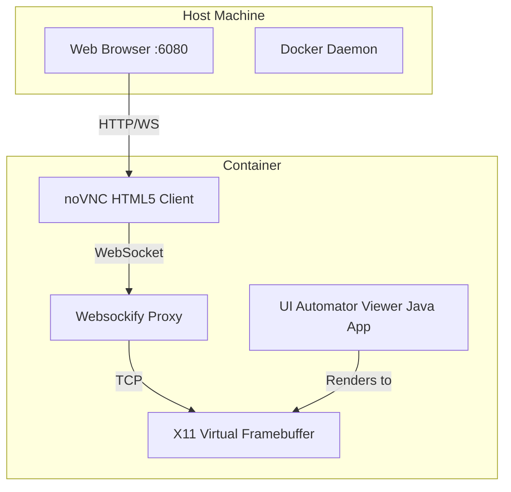

# uiautomatorviewer-docker-novnc 🐳

[]()
[]()

A containerized solution for running Android's **UI Automator Viewer** entirely within a web browser using Docker and noVNC. 

## 🎯 Objective
To solve the modern pain point of setting up Android SDK Studio solely to use the UI Automator Viewer component for determining Appium XPaths. This allows QA teams to inspect elements directly from a browser without installing bulky desktop applications.

## 🏗 Architecture & Design

This project avoids the overhead of a full desktop GUI by streaming a lightweight X11 frame buffer through a WebSocket proxy.



## 📚 Tutorial: How to Use the Containerized UI Automator Viewer

If you're building Appium scripts, finding correct XPath locators is critical. However, installing Android Studio just for the UI Automator Viewer is overkill. Here is how to use this lightweight container instead.

### 1. Start the Container
Run the following command in the terminal where the `docker-compose.yml` is located:
```bash
docker-compose up -d
```

### 2. Connect Your Physical Device
Ensure your Android device is connected to your host machine via USB and USB Debugging is enabled. The container mounts the host's `/dev/bus/usb` so that the `adb` running inside the container can see your device.

### 3. Access the Web UI
Open your favorite web browser and navigate to:
```text
http://localhost:6080
```
You will see a virtual desktop. Click on the terminal window and type `uiautomatorviewer` to launch the application.

### 4. Capture Screens
Click the "Device Screenshot" icon in the UI Automator Viewer to pull the current XML hierarchy and screenshot from your connected device!
```bash
docker-compose up -d
```
Then navigate to `http://localhost:6080` in your browser.

> *"I don't just automate tests. I build testers."* — Teddy Lioner
